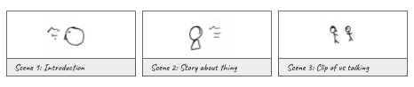

# Digital Storytelling & Project Planning 

## HSU Student Snapshots
“Student Snapshots” is a collection of video stories from Humboldt State University (HSU) students in their own voice. These stories are about the experiences of students as they live in Humboldt County and explore both the county and the HSU campus. Student Snapshots are quick 1-minute stories that share your unique experience from your own vantage point. Take a look at the [HSU Student Snapshots YouTube playlist](https://www.youtube.com/playlist?list=PLe7DUUoET6mUN1jP4pO6uKW9uyubSkQhC) (below) to see what people have already shared and then add your story.

<iframe width="560" height="315" src="https://www.youtube-nocookie.com/embed/V0VFkAwyfTU?rel=0" frameborder="0" allow="autoplay; encrypted-media" allowfullscreen></iframe>

This guide will help you with planning and preparing your story. Visit the accompanying online guide for more links and info: [libguides.humboldt.edu/snapshots/learn](libguides.humboldt.edu/snapshots/learn).

## Digital Media Lab Quick Guide
This short guide will get you started with your project. For more information about this or with other digital media projects, visit [http://libguides.humboldt.edu/dml](http://libguides.humboldt.edu/dml).

## Brainstorming Your Story

What will your story be? You have 1 minute to tell it, so it won't be an exhaustive autobiography. Instead, this will be a snapshot into one aspect of your life as a student at HSU. To find your 1-minute story, brainstorm some ideas. Grab a piece of paper or a friend and start coming up with ideas.

It might help to ask yourself some questions: Is it a day-in-the-life snapshot, a specific event, an overview of your first year, a letter to your friends back home? How do you feel today compared with your first day in class? What do you want to tell yourself 10 years from now? What advice do you have for future students? What advice do you have for your teachers or HSU employees? What's the one thing you love the most about HSU or Humboldt? What's the one thing you hate the most? What would you change?

Once you have a seed of an idea, it's time to start fleshing it out and planning how you will tell your 1-minute story.

## Planning

### Storyboard 
What will your video look like? Draw or write out what each scene will look like, the number of scenes you'll have, the location(s), the background, time of day, and anything else that you can think of.Think about what you need for these ideas. What type of lighting will you have? Is the environment noisy? Do you need a mic? Should you shoot at a time that it's less busy? What if it's raining on the day you plan to shoot? Scout out your spot ahead of time to see what you'll need to plan for.Take extra shots that you can use as transitions and voice-overs. This type of footage is called B-roll. With some B-roll, you can shoot yourself talking and then transition to other shots or images but continuing with your voice and audio.

### Script
Plan out what you're going to say or do. How long will it take you to say/do it? Act out the scene to see what you need to consider- does the camera need to move or will the mic pick up everything?

## Strategies

Figuring out how to craft your story can be the most daunting part of a video project. Luckily, you have a built-in constraint with the Student Snapshots project: you only have 1 minute to tell your story. That limits the scope of your story, but doesn’t narrow the possibilities for how you can capture it. To help with this, let’s look at three different examples of methods for creating a video. 

### 1. The Testimonial
This strategy is seen all over the web and on reality shows. It’s relatively simple to shoot and edit yet can be very impactful because it has a conversational tone to it. 

This type of video is usually set up so that the speaker is right in front of the camera and they talk directly to it. There may be multiple takes, but it’s all the same basic shot. The Testimonial requires some simple

editing but you’ll want to prepare and rehearse what you say so that you don’t make many mistakes but also sound conversational and not too rehearsed.  
#### Pros: Your shoot & editing will be straightforward.
#### Cons: Your word choice and delivery is more important because that’s all you have.

### 2. The Clip Collage
You probably already have a ton of photos and video on your phone, so why not use that for your video? By pasting clips together and recording narration over it, you can share many facets of your story visually, while sharing a clear message with your voice. This method will require a fair amount of edits, but you won’t have to shoot any new footage. There are many types of media you can use for your collage: photos, clips from TV, phone videos, social media videos.
#### Pros: You won’t need to shoot new footage. 
#### Cons: Lots of clips = lots of edits. 

### 3. The Documentary
This method probably requires the most work because it is a melding of the testimonial and collage. By switching between interview-style shots and other footage, you can utilize the strengths of both: strong and clear message with a personal touch and a series of impactful visuals.
#### Pros: Personal and conversational, with visual layers to enhance your story. 
#### Cons: You’ll need to shoot new footage and edit a bunch of clips. 

## What You’ll Need

Once you have an idea for how you’ll create your story, you need to start thinking about what you need: equipment, scenery, location, people, sound, etc. This will be covered in Part 2: Shooting Video & Recording Audio in more detail, but it’s important to start thinking about the basics so you have an idea of how much time and effort your project will take. Whichever of the three options you choose (or if you choose a fourth one!) will dictate what you need. To submit your video to be added to the HSU Student Snapshots playlist, follow these instructions: 1. Create your video -- borrow DML equipment and/or attend the Snapshots SkillShops for help. 2. Upload your video to YouTube. 3. Email HSUStudentSnapshots@gmail.com with a link to your video. 4. Tell your friends  family -- tag your posts #HSUStudentSnapshots.

## Resources

### Equipment options
The Digital Media Lab has video & audio editing software and equipment for you to check out at the front desk, free of charge. You can borrow anything for three days and can grab multiple items: 

+ DSLR cameras
+ GoPro Hero 6 cameras
+ camcorders
+ digital audio recorders
+ lapel mics
+ shotgun mics
+ USB microphones
+ lapel mics
+ shotgun mics
+ tripods
+ 360-degree cameras
+ webcams

### Remixing Content
You don’t have to create everything from scratch. There are plenty of images, songs, sounds, and more that you can borrow from others:

#### Music
+ [Free Music Archive](http://freemusicarchive.org/)
+ [YouTube Audio Library](https://www.youtube.com/audiolibrary/music?feature=blog)

#### Sounds & sound effects
+ [SoundBible.com](http://soundbible.com/)
+ [Zapsplat.com](https://www.zapsplat.com/)
+ [Freesound.org](https://freesound.org/)

#### Photos & graphics
+ [Pixabay.com](https://pixabay.com/)
+ [Pexels.com](https://www.pexels.com/)
+ [Flickr](https://www.flickr.com/) (search by license type)

You can use public domain or creative commons content without getting permission from the artist, but you should give them attribution at the end of your video and include links in your video description.

---
For more info visit: [http://libguides.humboldt.edu/dml](http://libguides.humboldt.edu/dml) or email dml@humboldt.edu

This guide has an open [Creative Commons license](https://creativecommons.org/share-your-work/licensing-types-examples/). You can use, share, remix and repurpose this content as long as you attribute the authors, Tim Miller, Jesse Garcia, &amp; Christina Cordova [CC BY](https://creativecommons.org/licenses/by/4.0/), 2018. If you’re re-using this guide, we’d love to hear about your project- dml@humboldt.edu.

